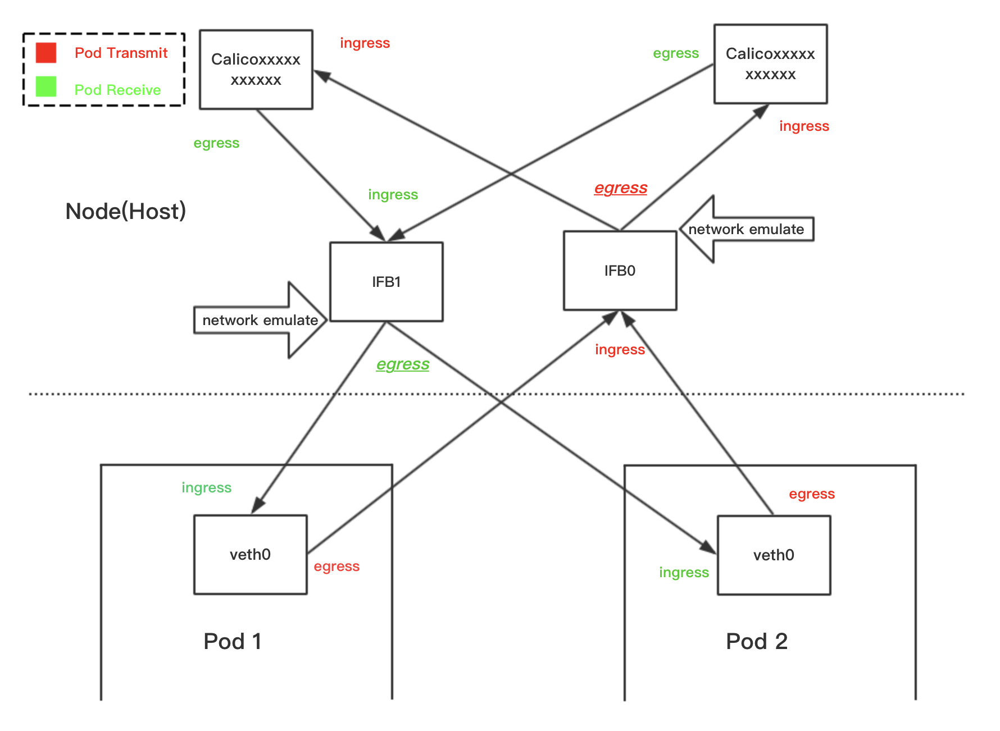
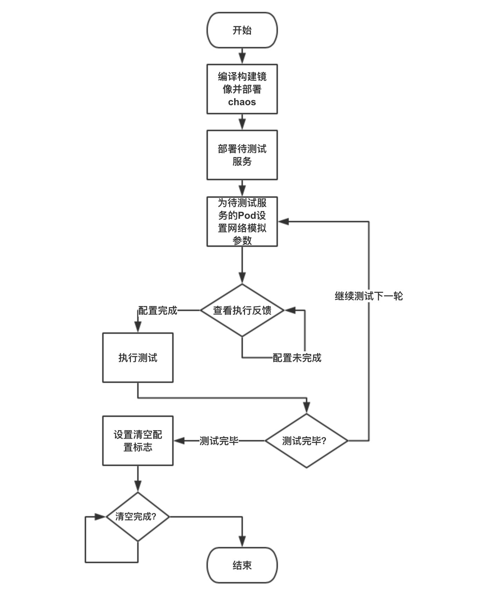
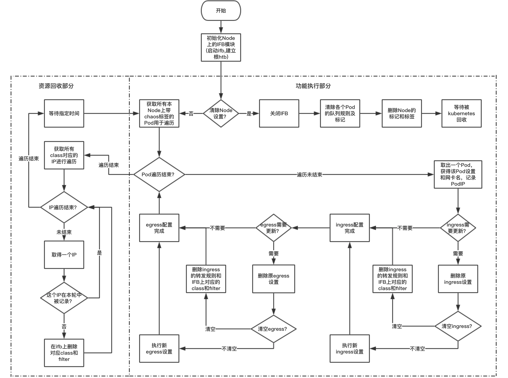

# README
kube-chaos是一个kubernetes平台的故障注入组件，使用iproute2实现恶劣网络环境的模拟。

注意：运行kube-chaos时，hostname必须与k8s上显示的node名一致，这一般是默认的，但一旦用户主动更改，则会导致kube-chaos运行出错，原因在于k8s没有pod定位自身所在pod的API，因此只能通过hostname来确定所处的Node。

## 文档目录

* **运行方式与原理**
* **流程图**
* **部署方式**
* **测试方式**
* **使用方式**
* **功能与参数说明**
* **数据结构**
* **类，接口**

## 运行方式与原理
目前kube-chaos的实现是，以Daemonset的方式在每个包含“kube-chaos=on”标签的Node上调度一个以hostnetwork和特权模式启动的Pod，该Pod从集群中找到有chaos标签的Pod，根据它们的Annotation上的参数，对其所属的虚拟网卡进行配置，实现恶劣网络环境的模拟。

配置网卡的方案具体为：

* 对于Pod的ingress流量，直接在Pod所属的虚拟网卡Calicoxxxxxxxxxxx上的egress采用Netem队列进行模拟；
* 对于Pod的egress流量，转发到Node的IFB网卡，在IFB网卡中针对各个Pod分类，在子类中挂载Netem队列，再发送到Pod所属的虚拟网卡，实现对各个Pod的egress流量的分别控制。

### 网卡设置示意图



## 流程图

### 用户使用流程


### chaos执行流程


## 部署方式

### 项目编译
kube-chaos使用go语言编写，安装go编译工具后，在项目根目录中使用
`GOOS=linux GOARCH=amd64 CGO_ENABLED=0 go build -v -i -o kube-chaos kube-chaos.go`

生成kube-chaos的linux可执行程序，由于kube-chaos使用Linux内核实现故障注入，因此其中目标平台必须为Linux。

### 生成镜像
在项目根目录中有一个Dockerfile，用于建立kube-chaos的容器镜像，我们已经将生成镜像所需的命令编写在脚本文件`autobuild.sh`中，运行`sh autobuild.sh`即可完成镜像的构建。

### 部署前准备
kube-chaos通过label识别要控制的Node和Pod，对于Node，需要为想要运行kube-chaos的Node增加`chaos=on`标签，这样kube-chaos才会在该Node上调度出一个执行chaos的Pod，对该Node上的Pod进行故障注入；同样的，对于需要被注入故障的Pod，需要为它们增加`chaos=on`标签（这些工作未来将由一个控制前端针对指定应用自动完成）。

在没有`chaos=on`标签的Node上的Pod，即使Pod有`chaos=on`的标签，它也不会被注入故障；同理，在有`chaos=on`标签的Node上的没有chaos=on标签的Pod也不会被注入故障。

这一步也可以在kube-chaos启动后进行。

### 进行部署
kube-chaos以Daemonset的方式部署，部署配置在项目目录中的chaos-daemonset.yaml中，在kube-chaos镜像生成后，使用kubectl根据该配置文件来部署kube-chaos:
`kubectl apply -f chaos-daemonset.yaml`

项目中有一个autodeploy.sh文件，它包含了该条指令，执行`sh autodeploy.sh`效果相同。

### 停止故障注入
如果想要在停止kube-chaos后继续正常运行被注入的Pod，需要首先为这些Pod的annotation中增加`chaos-reset=yes`标签，并等待该标签内容变成`chaos-reset=sucess`，此时针对该pod的故障注入配置将被清空，在所有被注入的Pod上完成该步骤后，可以将kube-chaos从集群中删除。

如果被注入的Pod也将同时关闭，则不需要上述步骤，直接在集群中删除kube-chaos即可。

在集群中删除kube-chaos，使用：`kubectl delete -f chaos-daemonset.yaml`即可。

## 测试方式
kube-chaos提供了测试用的镜像和测试所需的脚本，你也可以使用自己的镜像用于测试。

在kube-chaos部署完毕后，在集群中运行测试用的镜像，并查看该产生的Pod的名字和IP地址用于测试。

> 如果要使用kube-chaos提供的测试镜像，使用testpod/目录下的autobuild.sh来创建测试镜像，并使用testpod.yaml来部署测试Pod。

获得测试Pod名和IP后，执行`sh /testpod/tctest.sh [Pod名] [PodIP] >/dev/null &`来开启后台运行的自动测试，测试持续约2分钟，执行完毕后在`/tmp/test_output.txt`中查看测试结果

测试脚本执行的测试内容为逐个为测试Pod注入各个类型的模拟网络环境，并对该Pod执行Ping来探测网络环境。

测试结果大致如下：

```
Kube-chaos TC test

Delay test: {Delay:{Set:yes,Time:200ms,Variation:50ms}}

PING 192.168.102.230 (192.168.102.230) 56(84) bytes of data.
64 bytes from 192.168.102.230: icmp_seq=1 ttl=63 time=214 ms
64 bytes from 192.168.102.230: icmp_seq=2 ttl=63 time=206 ms
64 bytes from 192.168.102.230: icmp_seq=3 ttl=63 time=168 ms
64 bytes from 192.168.102.230: icmp_seq=4 ttl=63 time=216 ms
64 bytes from 192.168.102.230: icmp_seq=5 ttl=63 time=230 ms
64 bytes from 192.168.102.230: icmp_seq=6 ttl=63 time=242 ms
64 bytes from 192.168.102.230: icmp_seq=7 ttl=63 time=153 ms
64 bytes from 192.168.102.230: icmp_seq=8 ttl=63 time=174 ms
64 bytes from 192.168.102.230: icmp_seq=9 ttl=63 time=185 ms
64 bytes from 192.168.102.230: icmp_seq=10 ttl=63 time=240 ms

--- 192.168.102.230 ping statistics ---
10 packets transmitted, 10 received, 0% packet loss, time 8999ms
rtt min/avg/max/mdev = 153.576/203.375/242.680/29.708 ms

Loss test: {Loss:{Set:yes,Percentage:50%,Relate:25%}}

PING 192.168.102.230 (192.168.102.230) 56(84) bytes of data.
64 bytes from 192.168.102.230: icmp_seq=10 ttl=63 time=0.346 ms

--- 192.168.102.230 ping statistics ---
10 packets transmitted, 1 received, 90% packet loss, time 8999ms
rtt min/avg/max/mdev = 0.346/0.346/0.346/0.000 ms

...
```
观察测试的类型和参数并且观察ping的结果，可以用于确认kube-chaos是否正常运行并注入故障。

## 使用方式
目前完成的部分是最底层的执行组件，还没有自动执行的策略，因此需要手动用kubectl指定被测试的应用的所有pod的模拟参数，注意在命令行中需要为`"`符号前增加`\`转义符，例如：

```
kubectl annotate pod $1 kubernetes.io/ingress-chaos="{\"Delay\":{\"Set\":\"yes\",\"Time\":\"200ms\",\"Variation\":\"50ms\"}}" kubernetes.io/done-chaos=no --overwrite
```

并且要注意的是，要设置`kubernetes.io/done-chaos=no`以使设置生效。

后续我们将开发控制端根据策略自动设置并改变参数，并提供更简洁的接口来设置策略。

## 功能与参数说明
### 输入
* pod的annotation上标注的chaos设置；
* pod的label（用于标记需要进行故障注入的pod）。

---

### 输出
* 应用chaos设置后chaos将改变annotation上的`kubernetes.io/done-chaos`字段；
* 应用chaos设置后对应pod的网卡设置将会根据参数改变。

---

### 可注入故障类型

* **延迟（Delay）** 
* **丢包（Loss）**
* **重复（Duplicate）**
* **乱序（Reorder）**
* **损坏（Corrupt）**

----------------------------
#### 延迟
参数样例：`{Delay:{Set:"yes",Time:"100ms",Variation:"10ms"}}`

效果：产生一个平均为100ms，误差正负10ms的延迟。

---
#### 丢包
参数样例：`{Loss:{Set:"yes",Percentage:"50%",Relate:"25%"}}`

效果：产生50%的丢包几率，并且这个几率受到伪相关系数影响，即`下一次丢包几率=这次是否丢包*25%+50%*(1-25%)`。

---
#### 重复
参数样例：`{Duplicate:{Set:"yes",Percentage:"50%"}}`

效果：产生50%的重复包发生率，表现为大约每三个数据包中就有两个是一模一样的数据包。

---
#### 乱序
参数样例：`{Reorder:{Set:"yes",Time:"50ms",Percentage:"50%",Relate:"25%"}}`

效果：50%的数据包会产生50ms的延迟，从而导致包的顺序会被打乱，其中50%的几率受到25%的伪相关系数影响。

---
#### 损坏
参数样例：`{Corrupt:{Set:"yes",Percentage:"3%"}}`

效果：3%的数据包中会出现数据损坏（即数据被改变）。

## 数据结构
### TC控制参数
kube-chaos通过Pod上的Annotation进行网络环境模拟的配置，为了将参数能够置于Annotation中的键值对中，chaos使用JSON格式来表示TC控制参数。

在Go语言中具体的格式为：

```
type TCChaosInfo struct {
	Delay struct {
		Set       string
		Time      string
		Variation string
	}
	Loss struct {
		Set        string
		Percentage string
		Relate     string
	}
	Duplicate struct {
		Set        string
		Percentage string
	}
	Reorder struct {
		Set         string
		Time        string
		Percengtage string
		Relate      string
	}
	Corrupt struct {
		Set        string
		Percentage string
	}
}
```
JSON样例：
`{Delay:{Set:"yes",Time:"100ms",Deviation:"10ms"}}`(该设置将网卡延迟增加100ms，误差10ms)

由于只能同时模拟一种网络环境，kube-chaos将自上而下扫描各个字段中的Set是否为`yes`，如果是，则采用该项设置，忽略下方的其他设置

比如如下参数：
`{Delay:{Set:"",Time:"100ms",Deviation:"10ms"},Loss:{Set:"yes",Percentage:"50%",Relate:"25%"}`
会将网卡设置为50%丢包率，相关性25%。

### 参数更新标志
由于chaos通过annotation来进行设置，因此需要轮询各个pod的annotation，为此需要设置`chaos-done`标志来指示设置的状态。

* 当新增或更改设置时，将`kubernetes.io/done-chaos`设置为no；
* 当chaos组件检测到`kubernetes.io/done-chaos`为no时将更新设置，并在完成后将`kubernetes.io/done-chaos`置为yes；
* 当chaos组件检测到`kubernetes.io/done-chaos`为yes时，跳过当前设置。


## 类与接口


